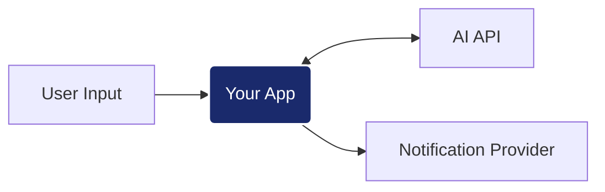

# AI Engineer Challenge: Intelligent Notification Service

## El Reto
Tu objetivo es implementar un servicio que procese entradas de lenguaje natural, extraiga información estructurada mediante un motor de IA y coordine el envío de notificaciones. La solución debe ser capaz de manejar la incertidumbre de los LLM (ruido en respuestas, formatos inconsistentes) y la latencia del procesamiento cognitivo.

---

## Contrato de API
Para que la suite de validación pueda ejecutar los tests, debes implementar estrictamente los siguientes endpoints en una instancia de **FastAPI** corriendo en el puerto `5000`.

### Requisitos de estructura
- **Punto de Entrada:** `app/main.py`
- **Instancia:** `app = FastAPI()`
- **Puerto local:** `localhost:5000`

### 1. Ingesta de Intenciones
- **POST** `/v1/requests`
- **Input:** `{"user_input": "Manda un mail a feda@test.com diciendo hola"}`
- **Output:** `201 Created` con `{"id": "string"}`

### 2. Procesamiento de Envío
- **POST** `/v1/requests/{id}/process`
- **Lógica esperada:**
    1. **Extracción:** Llamar a la IA en `localhost:3001/v1/ai/extract`.
    2. **Prompting:** Diseñar instrucciones para que la IA devuelva un JSON con: `{"to": "...", "message": "...", "type": "email|sms"}`.
    3. **Guardrails:** Implementar lógica para limpiar y validar la respuesta (quitar Markdown, corregir JSON mal formado, etc).
    4. **Notificación:** Si es válido, enviar a `localhost:3001/v1/notify`.
- **Output:** `200 OK` o `202 Accepted`

### 3. Consulta de Estado
- **GET** `/v1/requests/{id}`
- **Output:** `200 OK` con `{"id": "string", "status": "queued|processing|sent|failed"}`

---

## Integración con el Provider
El motor de IA y el servicio de notificaciones están disponibles en `localhost:3001`. Ambos requieren el encabezado de seguridad: `X-API-Key: test-dev-2026`.

- **Motor IA:** `/v1/ai/extract` (Esquema estándar de mensajes `system`/`user`).
- **Notificaciones:** `/v1/notify` (Esquema definido en los docs del provider).
- **Documentación:** Puedes consultar los Swagger Docs en `http://localhost:3001/docs`.

---

## Ejecución y Evaluación
1. **Levantar infraestructura:** `docker-compose up -d provider influxdb grafana`
2. **Tu aplicación:** `docker-compose up -d --build app`
3. **Validación (k6):** `docker-compose run --rm load-test`
4. **Resultados:** Visualiza el scorecard en tiempo real en [Grafana (localhost:3000)](http://localhost:3000/d/ia-performance-scorecard/)

---
*Se valorará la robustez frente a errores inesperados, la calidad del prompting y la arquitectura del pipeline de procesamiento.*
