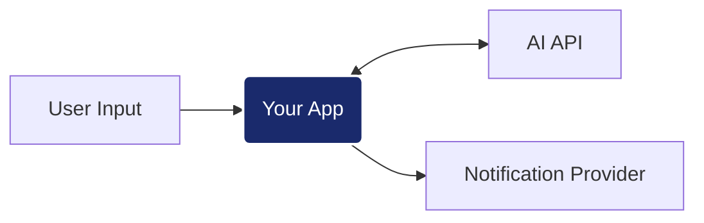

# AI Engineer Challenge: Intelligent Notification Service

## El Reto
Implementar un servicio que procese entradas de **lenguaje natural**, extraiga la información mediante un motor de IA y coordine el envío del mensaje resultante. Tu objetivo es diseñar una solución capaz de manejar la incertidumbre de los LLM y la latencia del procesamiento cognitivo.

## Contrato de API
Para que la suite de tests (`k6`) pueda validar tu solución, debes implementar estrictamente los siguientes endpoints:

### Consideraciones Técnicas
Para que el contenedor `app` de Docker pueda arrancar tu solución, debes respetar la siguiente estructura base:
- **Punto de Entrada:** El archivo principal debe ser `app/main.py`.
- **Instancia de API:** Debes definir una instancia de FastAPI llamada `app` (ej: `app = FastAPI()`).
- **Puerto:** La aplicación debe correr internamente en el puerto `5000`.

### 1. Ingesta de Intenciones (NLP)
- **Ruta:** `POST /v1/requests`
- **Cuerpo (JSON):** `{"user_input": "string"}` (Ej: "Envía un mail a feda@test.com diciendo hola")
- **Respuesta:** `201 Created` con JSON `{"id": "string"}`.

### 2. Procesamiento de Envío
- **Ruta:** `POST /v1/requests/{id}/process`
- **Descripción:** Ejecuta el pipeline de procesamiento dinámico:
    1. **Extracción con IA**: Llamar a `http://mock:3001/v1/ai/extract`.
    2. **Prompt Engineering**: Debes diseñar un `system prompt` que instruya a la IA a extraer del mensaje del usuario un JSON con la siguiente estructura: `{"to": "destinatario", "message": "mensaje", "type": "email|sms"}`.
       - *Nota:* Para garantizar la estabilidad de la suite de tests, el mock utiliza lógica interna para resolver la extracción, por lo que el contenido de tu prompt no variará el resultado técnico del mock. Sin embargo, **la calidad, claridad y robustez de tus instrucciones (prompting) serán factores determinantes en la evaluación humana.**
    3. **Guardrails y Parsing**: Implementar lógica para limpiar y validar la respuesta de la IA (manejo de ruido Markdown, alucinaciones de formato, llaves inconsistentes, etc.).
    4. **Notificación**: Si la extracción es válida, realizar el envío final a `http://mock:3001/v1/notify`.
- **Respuesta:** `200 OK` o `202 Accepted`.

### 3. Consulta de Estado
- **Ruta:** `GET /v1/requests/{id}`
- **Respuesta:** `200 OK` con JSON `{"id": "string", "status": "queued|processing|sent|failed"}`.

## Integración Externa (Provider)
Tu servicio debe consumir tanto el motor de IA como el servicio de notificaciones:
- **Motor de IA (Standard API):** `POST http://provider:3001/v1/ai/extract`
    - Requiere el header `X-API-Key: test-dev-2026`.
    - Espera un esquema de mensajes `{"messages": [{"role": "system", "content": "..."}, {"role": "user", "content": "..."}]}`.
- **Notificaciones:** `POST http://provider:3001/v1/notify`.
- **Documentación del Provider:** Una vez levantado el entorno, consulta su API Docs en `http://localhost:3101/docs`.

## Infraestructura y Evaluación
El entorno utiliza Docker Compose e incluye herramientas de observación:
1. **Preparar infraestructura:** `docker-compose up -d provider influxdb grafana`
2. **Levantar tu aplicación:** `docker-compose up -d --build app`
3. **Ejecutar validación:** `docker-compose run --rm load-test`
4. **Scorecard de Ingeniería:** Los resultados se visualizan en tiempo real en Grafana: [http://localhost:3100/d/ia-performance-scorecard/](http://localhost:3100/d/ia-performance-scorecard/)

---
*Nota: Se evaluará la arquitectura de la solución, la robustez del pipeline de IA (Guardrails) y su capacidad de respuesta bajo carga.*
